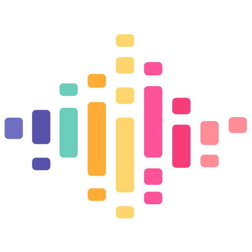

<p align="center">
<h1 align="center">Vue3声音模拟器</h1>
</p>
<p align="center"></p>

## 项目描述

这是一个声音模拟器项目，旨在帮助患有注意力缺陷多动症（ADHD）和学习困难的儿童提高专注力。我发现市面上现有的声音模拟器无法满足需求，因此决定自己开发一个。该应用支持同时播放多个声音，以便为孩子创造一个有利于学习和放松的环境。通过个性化的声音体验，帮助孩子在学习中找到乐趣，提升专注力。

## 项目预览

<a target="\_blank" href="https://sound.fesujian.com">在线预览</a>

## 项目截图

<p align="center">

</p>

## 技术栈

- **Vue 3**: 现代前端框架
- **Vite**: 快速的构建工具
- **Tailwind CSS v3.x**: 实用的 CSS 框架
- **PWA**: 离线支持

## 安装依赖

```bash
yarn
```

---

## 启动

```bash
yarn dev
```

---

## 编译

```bash
yarn build
```

---

## License

Built by FEsujian, and released for free under the MIT license, which means you can use it for almost any purpose
(including commercial projects). We appreciate credit where possible, but it is not a requirement.
